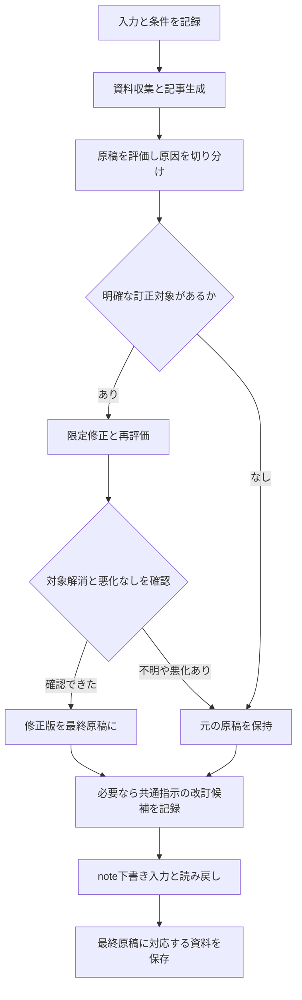

# note作成・評価・改善を一度のActionで実行する

実際の入口は **`.github/workflows/main.yml` → `note-workflow.mjs`** です。
テーマなど従来の5項目を入力すると、資料収集、記事生成、評価、必要な訂正、note下書き作成、見直し用レポートの保存まで進みます。実行途中の質問はありません。

今回の改修はソースとモックで検証しています。実際のClaude APIの評価精度・費用と、現時点のnote画面での保存は未実測です。

## 通常の使い方

1. Secretsに `ANTHROPIC_API_KEY` と、下書き保存を行う場合は `NOTE_STATE_BASE64` を設定します。
2. Actionsから **Note Workflow** を選び、従来の `theme / target / message / cta / tags` を入力します。
3. `dry_run: true` では生成・評価・レポート作成まで実行します。Claude APIは呼び出すため、無料のモックテストではありません。
4. `dry_run: false` では最終原稿をnoteの下書きへ入力し、別ページで読み戻して一致を確認します。
5. 実行結果のSummaryで重要な問題を確認し、Artifactsの `note-review-実行ID-試行番号` をダウンロードします。

`is_public` は従来の入力との互換性のため記録します。**この実行経路は下書き作成のみです。公開操作は実装していません。** 過去のREADMEには公開まで行う旨の説明がありましたが、改修前の `main.yml` が呼ぶ実際のコードは公開操作をしていませんでした。

`.github/workflows/note.yaml` と `note-perplexity.yaml` は別の旧実験フローです。通常の実行入口として今回接続しているのは `main.yml` です。

## 実行される処理



- 初回の原稿と修正版は別々に保存します。最終的にどちらを採ったかも記録します。
- 評価が失敗した場合は自動修正を行わず、取得できた原稿の下書き作成を続けます。評価は失敗・未確認と明示します。
- 生成が途中終了・不正JSONになった場合は、不完全な文章をnoteへ入力せず、失敗と取得済み記録を残します。
- 修正は根拠が明確な対象に対する1回の訂正と再評価で、繰り返し書き直すループはありません。
- 新しい事実、失われた内容、未確認の変更、品質項目の悪化、再評価で残る重大な指摘があれば修正版を保留します。
- 共通プロンプトの候補は別に作成します。候補の作成・比較・採用・次回での実使用は別の状態です。

## 自動評価の意味

`prompts/judge-v1.txt` と `lib/domain.mjs` の `RUBRIC` に基準を置いています。

| 観点 | 確認すること |
|---|---|
| Q1 | 読者との適合・読む理由 |
| Q2 | 記事の約束の達成 |
| Q3 | 理解・判断への貢献 |
| Q4 | 文章としての伝わりやすさ |

各項目は0〜4の段階評価です。総合100点には換算せず、評価不能は `null` にします。基準は初期運用の定義であり、人の判断との一致を実測して較正した数値ではありません。

事実の確認状態は `supported / contradicted / insufficient / unverified` に分けます。外部の確認には取得した資料IDを要求し、引用が原稿に存在するかも検査します。著者の主張を支持する場合には、入力と記事の一致する引用を要求します。言い換えを含め確認できない著者情報は未確認として残します。本人の入力との一致は、独立した事実検証を意味しません。

資料はClaudeのWeb検索が返す**引用抜粋**と取得日時を保存します。取得した範囲を超えて記事全体の正確率を保証しません。検索の失敗、上限到達、引用未取得もそのまま残します。生成と評価は別の呼び出しですが、同じモデルを使う既定設定は独立した真実の判定者ではありません。

## 何が原因で、どこを直したか

各指摘に原文・理由・根拠・修正先・原因の確かさを記録します。

| 原因候補 | 主な修正先 |
|---|---|
| 入力・根拠不足 | 根拠取得、主張の限定、今回の記事 |
| 生成指示の不足・矛盾 | 記事修正、対象範囲を決めた指示候補 |
| 評価の誤判定 | 評価指示・基準・資料取得 |
| 処理・保存の不具合 | 該当するプログラム |
| 未切り分け | 仮説と追加検証案の記録 |

原因分類はAIの診断も含むため、確認済み・仮説・未切り分けを区別します。指摘が出たというだけで生成プロンプトを変更しません。

## 自動で残る資料

`output/runs/<run-id>/` に、次の記録を残します。

| 保存先 | 内容 |
|---|---|
| `manifest.json` | 入力、実行ID、コード・設定情報 |
| `events/` | 実際のプロンプト、API要求と応答、評価、変更判断、使用量、失敗を順に保存 |
| `assets/final-article.json` / `.md` | 最終的に選んだ原稿 |
| `assets/candidate-prompt.txt` | 作成した場合の共通プロンプト改訂候補全文 |
| `reports/<report-id>/report.md` / `.html` | 概要、縦型の指摘・変更、前後全文・機械差分、根拠、後日の判断 |
| `promptfoo/` | 比較モードのPromptfoo元データ・HTML・正規化評価 |

レポートの先頭には、重要な問題、主な変更と結果、未解決・悪化、候補の採否、note保存状態を表示します。詳細には**改善前・改善後のプロンプト全文と差分、どの記事のどの指摘で何を変更したか、期待した変化と観察結果**を残します。改訂不要・未実行の場合は、架空の改善後出力を作りません。

実行記録を後から書き換えず、後日のフィードバックや採否は追記します。再生成したレポートには版・表示基準時点を付け、以前の版を残します。

```bash
npm run report -- output/runs/<run-id>
npm run report -- output/runs/<run-id> --as-of 2026-09-13T12:00:00Z
npm run report -- output/runs/<run-id> --feedback feedback.json
```

`feedback.json` の例：

```json
{
  "type": "feedback.appended",
  "data": {
    "occurredAt": "2026-09-13T12:00:00Z",
    "actor": "owner",
    "findingId": "F1",
    "comment": "この指摘は採用。表現の好みだけの指摘は見送り。"
  }
}
```

`adoption.decided` で採否を追記しても、共通設定ファイルを自動で変更することはありません。実際に採用する場合は候補を版付きファイルとしてGitへ追加し、`config/quality.json` の参照先を変更します。次回の `run.started` と実際の要求には使用した版・全文・ハッシュが記録されます。過去の実行が新しい版を使ったことにはしません。

APIキー・Cookie・認証状態を成果物に含めず、取得できない費用は0円にしません。Artifactsの保持期間はリポジトリの設定に従います。保存期間を超える長期履歴の保管先は未決定です。

## Promptfooで比較する

通常の記事作成は共通の評価関数を呼び、**比較モードでは同じ評価関数をPromptfooの実エンジンから呼びます**。入力ごとに旧版と候補版を横並びにして比較します。毎記事で旧新版を再生成する必要はありません。

```bash
npm run eval:compare -- --mode generation \
  --cases evals/cases.example.json \
  --baseline prompts/generate-v2.txt \
  --candidate prompts/generate-v3.txt
```

`generate-v3.txt` は実際の改訂候補を保存してから指定してください。サンプル事例は比較方法の入力例であり、検証済みの正解や未使用の最終確認用データではありません。`generation` では、事例ごとに一度収集した資料を共通に使い、旧・新の指示でそれぞれ新規生成します。

評価器を比べる場合は、各事例に `article: { "title": "...", "body": "..." }` を入れ、同じ原稿を旧・新の評価指示で採点します。

```bash
npm run eval:compare -- --mode judge \
  --cases evals/judge-cases.json \
  --baseline prompts/judge-v1.txt \
  --candidate prompts/judge-v2.txt
```

評価器比較では必要に応じて `--baseline-model` と `--candidate-model` を指定できます。新たな生成は行いません。評価の変化だけでは精度向上とはせず、本人の見直しや根拠との照合が必要です。

GitHubからは **Compare note prompts** を手動実行できます。比較中にnoteへ記事を作成することはありません。候補の自動採用もしません。

Promptfooのnative `PASS/score` は評価記録の形式と記事の対応の正常性です。記事の品質・公開・採用判断とは異なります。Q1〜Q4の元の段階評点、未確認、指摘は正規化データと独自レポートに保持します。詳しいAPI・出力の注意は [evals/README.md](evals/README.md) に記載しています。

## 設定・費用・未決定事項

`config/quality.json` でモデル、出力長、通信タイムアウト、検索、限定修正、候補生成を設定できます。既定モデルは改修前と同じ `claude-sonnet-4-5` です。環境変数 `GENERATION_MODEL / JUDGE_MODEL / RESEARCH_ENABLED / QUALITY_CONFIG / REPORT_OUTPUT_DIR` でも指定できます。

`maxTokens`、通信タイムアウト、検索上限は処理を有限にするための設定であり、記事の合格点や最適な予算ではありません。既定では検索要求の上限を3回にし、記事修正は1回のみです。APIの内部再試行を無効にして、実際の呼び出しを一件ずつ記録しています。上限到達・途中終了時は確認済みと表示しません。

通常は検索・生成・評価に加え、必要なら修正・再評価・変更確認・候補生成のAPI利用が発生します。トークンと所要時間は実測値を記録し、料金計算の単価を設定していないため費用は未取得として表示します。

**壁打ちする必要がある項目**：良化と悪化が混在した候補の優先順位、共通指示の自動採用範囲、許容費用と待ち時間、長期保存先。これらを未決定のまま自動採用の条件に補っていません。候補は保留し、採用済みの設定で記事作成を続けます。

## 開発・テスト

Node.js 24を使います。Promptfooは `0.123.0` を直接固定し、全依存関係は `package-lock.json` と `npm ci` でそろえます。

```bash
npm ci
npm test
```

テストではClaude APIとnoteをモック化し、外部のモデル・noteへ書き込みません。Promptfoo比較テストは実際のPromptfooエンジンを使い、評価関数だけをテスト用に置き換えます。

テスト対象は、途中終了、評価失敗、引用と根拠IDの不一致、根拠のない著者情報、重大問題の入れ替わり、解消確認の取り違え、最終評価と保存原稿のハッシュ、保存の読み戻し、履歴の上書き防止などです。日本語評価の実精度やnote UIのライブ互換性を検証した結果ではありません。

## noteログイン状態

既存の `login-note.mjs` で手動ログインし、`note-state.json` を取得します。生成したファイルをBase64化して `NOTE_STATE_BASE64` Secretへ保存します。認証情報をIssue・記事・実行レポートへ貼らないでください。認証状態が切れた場合は再取得します。

保存確認は、入力後に永続的な編集URLを別ページで開いてタイトルと本文を照合する方式です。改行コード以外の相違は成功として扱いません。Markdownは従来と同じく本文へテキストとして入力するため、リッチテキストとしての見出し・コードの装飾は保証しません。

## 参照した公式仕様

- [Promptfoo Node API](https://www.promptfoo.dev/docs/usage/node-package/)
- [Promptfoo出力形式](https://www.promptfoo.dev/docs/configuration/outputs/)
- [Promptfooプロンプト最適化](https://www.promptfoo.dev/docs/usage/prompt-optimization/)
- [Claude構造化出力](https://platform.claude.com/docs/en/build-with-claude/structured-outputs)
- [Claude Web検索](https://platform.claude.com/docs/en/agents-and-tools/tool-use/web-search-tool)

仕様確認日：2026-09-13。検索は引用付きの別呼び出し、生成・評価はJSON構造化出力として、互換性のない引用とJSON出力を同じ要求に混ぜていません。
