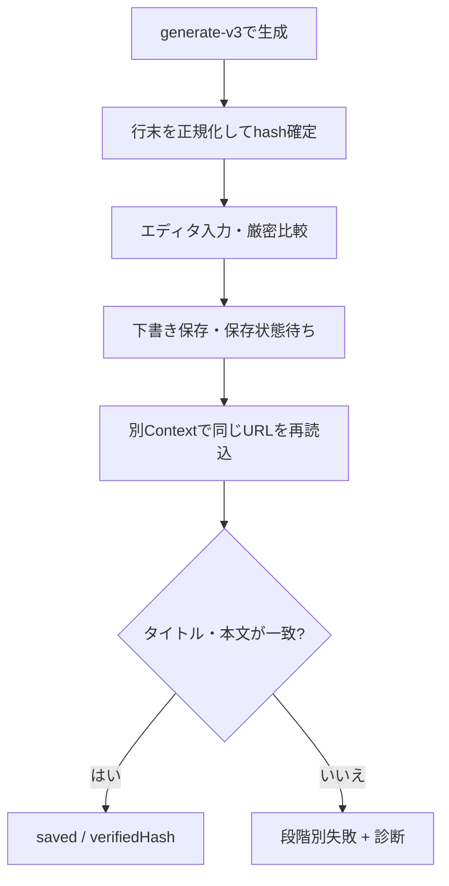

# Run 34786753816：note下書き保存未確認の調査・修正記録

## 結論

[GitHub Actions run 34786753816](https://github.com/k34259043-maker/github-actions-note/actions/runs/34786753816) は、noteへの本文入力後の厳密比較で不一致になり、保存処理へ進む前に停止した。直接の記録は `note.status=input_only`、`note.reason=editor_input_mismatch` であり、画面に出た `Run status: save_unconfirmed` は実行全体が保存失敗を一括表現した値だった。

生成本文に「行末の半角スペース2個」が3行あったことと、リッチテキストエディタから読み戻した文字列との不一致は強く関連すると考えられる。ただし、当時の記録には読み戻し値や最初の差分位置がなく、これが唯一の原因だったとは証明できない。このため、比較条件を緩めて成功扱いにするのではなく、生成前提の正規化、保存操作、再読込検証、診断を一体で改修する。

## 確認済みの事実

| 証拠 | 確認内容 | 判断 |
| --- | --- | --- |
| `note.completed` | `status=input_only`、`reason=editor_input_mismatch` | 本文入力後の比較で停止し、保存確認には到達していない |
| `run.completed` | `status=save_unconfirmed`、終了コード1 | 実行全体の状態が原因を粗く一般化していた |
| note記録 | 永続的な編集URLは取得済み、`verifiedHash=null` | 下書きらしき対象は存在するが、保存内容の一致は未確認 |
| 最終生成本文の機械的確認 | 82行で、行末が半角スペース2個の行が3行 | 入力不一致と整合する観測。ただし因果の単独証明ではない |
| 実行順序 | エディタ入力の直後、保存操作より前に終了 | 保存ボタンや保存完了待ちの失敗が、このrunの直接原因ではない |

記事本文、秘密情報、非公開の編集URLは本記録に転載しない。

## 強い仮説と限界

強い仮説は、Markdownの強制改行として生成された行末スペース2個が、noteのリッチテキスト編集領域の `innerText` では同じ形で保持されず、文字列の完全一致を壊したというもの。3行の入力上の特徴と `editor_input_mismatch` は一致する。

一方、当時は次の情報を保存していなかったため、唯一の原因とは断定しない。

- エディタから読み戻した値の長さ・ハッシュ・改行数
- 最初に異なった文字位置
- タイトルと本文のどちらが不一致だったか
- エディタ側で行末空白以外の正規化が発生した可能性

## 検討した別の説明

| 説明 | 当該runでの評価 | 根拠 |
| --- | --- | --- |
| ログイン情報が最初から使えなかった | 直接原因ではない可能性が高い | ログイン状態の復元後、編集画面で入力し永続的な編集URLを得ている |
| 保存ボタンが見つからなかった | 当該runの直接原因ではない | 保存操作より前の入力比較で停止した |
| 60秒の操作期限切れ | 当該runの直接原因ではない | 入力直後に `editor_input_mismatch` が記録された |
| 記事生成・評価APIの失敗 | 当該runの直接原因ではない | 最終記事と評価レポートが作られ、note処理まで進んでいる |
| note側の別の文字正規化・DOM変更 | 未排除 | 当時は差分位置と読み戻し指紋がなく、行末空白以外を切り分けられない |

## 修正前から修正後への変更

| 対象 | 修正前 | 修正後 | 狙い |
| --- | --- | --- | --- |
| 生成プロンプト | `generate-v2` に行末空白の禁止なし | `generate-v3` で行末スペース・タブと「半角スペース2個の強制改行」を禁止 | noteに投入する表現を最初から安定化 |
| 本文とハッシュ | モデル出力の行末空白を含めて記録・ハッシュ化 | 各行末の水平空白を除去してから本文を確定し、確定後の本文をハッシュ化 | 保存対象と検証対象を同じ正規形に固定 |
| 入力直後の照合 | 不一致理由を `editor_input_mismatch` だけで記録 | タイトル・本文を別々に比較し、長さ、行数、改行数、SHA-256、最初の差分位置を構造化 | 本文をログへ出さずに原因を切り分ける |
| 下書き保存 | 入力後の待機に依存 | 表示中かつ有効な、名称が完全一致する `下書き保存` ボタンだけを明示的に押す | 曖昧な操作を避け、下書き保存を要求 |
| 保存完了待ち | 固定時間待機 | `保存中…` から `下書き保存` へ戻る状態、または自動保存の待機時間と永続URLを確認 | 待機時間だけで保存成功とみなさない |
| 保存内容の検証 | 同じ画面の入力結果に依存 | 入力前からある認証状態を隔離したBrowserContextで使い、同じ永続編集URLを再読込してタイトル・本文を完全一致で確認 | 画面上の入力や入力後のlocalStorageと、サーバー側の永続化を分離して検証 |
| 実行状態 | note失敗を広く `save_unconfirmed` と表示 | `note_not_started`、`note_input_incomplete`、`save_unconfirmed` を保存段階に応じて区別 | 失敗地点をActions画面から判別可能にする |
| Actionsログ | Run statusとレポートパス中心 | 安全な `Note status` と `Note reason` をログとStep Summaryへ追加 | Artifactを開く前に一次原因を確認可能にする |
| ログイン事前確認 | 有料の生成処理後に保存段階で判明し得た | 非dry-runでは、秘密情報を出さずにstorage-stateの有無・JSON形状・有効なnote状態を検査し、編集画面や `/new` ではなく読み取り専用の公式 `/notes` へアクセスする。描画済みの `main` とURLが一定時間安定するのを待ち、遅れて発生するログイン画面への転送も検出してから生成へ進む | 認証不備のまま生成費用を使うことと、事前確認による空下書き作成を防ぐ |
| 認証一時ファイル | 実行終了後に削除 | レポートのArtifact化より前に削除し、復元途中の `.tmp` もcleanup・Git除外の対象に追加 | 中断・失敗時の認証情報残留と誤コミットを防ぐ |
| レポート | 保存失敗の概要が粗い | reason、stage、セレクタ候補数、比較結果、検証方法を安全な形で表示 | 事実と推測を分けて再調査可能にする |
| 診断情報の安全性 | 生の例外や非公開編集URLを扱う余地 | 記録項目を許可リストで投影し、安定したコードと数値・指紋だけを保存診断へ残す。記事本文の観測値、ブラウザ例外本文、非公開編集URLは記録しない | 本文、トークン、非公開URLの不用意なログ・Artifact出力を抑える |
| Workflowの識別 | `main.yml` と旧 `note.yaml` が同じ `Note Workflow` 表示 | 現行を `Current - Draft Only`、公開操作を含む旧系統を `Legacy ... (Can Publish)` と表示 | Actions画面での誤選択による意図しない公開を避ける |
| Promptfoo実行 | 既定のテレメトリ・更新確認・共有設定に依存 | npm scriptsと比較用Actionで無効化用の環境フラグを明示 | 比較記録をリポジトリ側で管理する方針を実行設定にも反映 |

`is_public` の値にかかわらず、この処理は下書き作成・検証だけを対象とする。公開ボタンを探す、押す、公開済みと推定する処理は追加しない。

## 修正後の処理フロー

## 検証状況

| 検証 | 結果 |
| --- | --- |
| テストケース | 78件はいずれも成功。最終変更の影響範囲71件を再実行し、Promptfoo系7件は直前の一括実行で成功 |
| note保存処理の対象テスト | 25件中25件成功 |
| GitHub Actions workflowのYAML解析 | 5ファイルすべて成功 |
| workflow内のshell `run` ブロックの構文確認 | `main.yml` 5件と `evaluate.yml` 2件、計7件すべて `bash -n` 成功 |
| Node.jsソースの構文確認 | 成功 |
| `git diff --check` | 成功 |

本文正規化・ハッシュ、入力不一致、明示保存と自動保存待ち、別Context再読込、段階別状態、ログイン事前確認、未保存を保存済みと表示しないレポート動作は自動テストの対象に含まれる。

実際のnoteアカウントと現在のnote UIを使うlive E2Eは未実行である。したがって、上記結果はコード上の分岐と模擬ブラウザ動作の検証であり、実環境での下書き保存成功を証明するものではない。

## 残るリスク

- noteのDOM、ボタン名、URL形式は公開された固定APIではなく、UI変更の影響を受ける。
- 永続編集URLが得られても、最新内容が保存された証明にはならない。再読込一致が必要。
- リッチテキストエディタが行末空白以外も変換する場合は、今回の正規化だけでは不一致が残る。その場合も診断値を見てから正規化規則を追加し、比較を無条件に緩めない。
- 別Contextでの一致は編集画面への永続化を示すが、公開状態や公開ページの描画を証明しない。
- noteの自動保存時間はネットワークやサービス状態で変動し得るため、固定待機だけを成功条件にしない。
- storage-stateのJSON検証はworkflowとNode.js側の二段階にあり、現在は同じ条件だが、将来の変更時には条件差が生じないか確認する。
- 旧 `note.yaml` と `note-perplexity.yaml` は明示的な公開操作を保持している。用途が未確認なので無効化・削除はせず、Actions上の表示名だけを `Legacy ... (Can Publish)` に変更した。残すか無効化するかは別途判断が必要である。

## 管理された実環境テスト

再実行前に、今回入力された記事がnoteの「自分の記事」に下書きとして残っていないか確認する。永続的な編集URLまで取得しているため、失敗表示でも既存下書きが存在する可能性がある。確認せず再実行すると重複下書きを作る恐れがある。

- [ ] 既存の同一タイトル・同一内容の下書きを確認し、重複時の扱いを人が決める
- [ ] `dry_run=true` で生成・採点・レポートだけが完了し、noteを操作しないことを確認する
- [ ] テスト用入力を使い、`dry_run=false` を1回だけ実行する
- [ ] ActionsログのRun status、Note status、Note reasonが失敗段階と一致することを確認する
- [ ] ArtifactのMarkdown/HTMLレポートで、入力比較・保存待ち・再読込検証の各段階を確認する
- [ ] noteの「自分の記事」で下書きが1件だけ存在し、タイトル・本文が一致することを人が確認する
- [ ] 公開ページが作られていないことを確認する
- [ ] 失敗時は自動再実行せず、reasonとstageを確認してから再試行の可否を決める

## 参照

- [GitHub Actions run 34786753816](https://github.com/k34259043-maker/github-actions-note/actions/runs/34786753816)
- [noteヘルプ：下書きに保存する](https://www.help-note.com/hc/ja/articles/360009035633-%E4%B8%8B%E6%9B%B8%E3%81%8D%E3%81%AB%E4%BF%9D%E5%AD%98%E3%81%99%E3%82%8B) — PCでは明示的な下書き保存ができ、入力停止後の自動保存も案内されている。
- [noteヘルプ：エディタ（記事編集画面）でできること](https://www.help-note.com/hc/ja/articles/360012426133-%E3%82%A8%E3%83%87%E3%82%BF-%E8%A8%98%E4%BA%8B%E7%B7%A8%E9%9B%86%E7%94%BB%E9%9D%A2-%E3%81%A7%E3%81%A7%E3%81%8D%E3%82%8B%E3%81%93%E3%81%A8) — 自動保存と `保存中…` / `下書き保存` の表示状態が案内されている。
- [noteヘルプ：下書き保存した記事を見る](https://www.help-note.com/hc/ja/articles/360010323614-%E4%B8%8B%E6%9B%B8%E3%81%8D%E4%BF%9D%E5%AD%98%E3%81%97%E3%81%9F%E8%A8%98%E4%BA%8B%E3%82%92%E8%A6%8B%E3%82%8B) — 認証事前確認と再実行前の重複確認に使う「自分の記事」一覧の案内。
